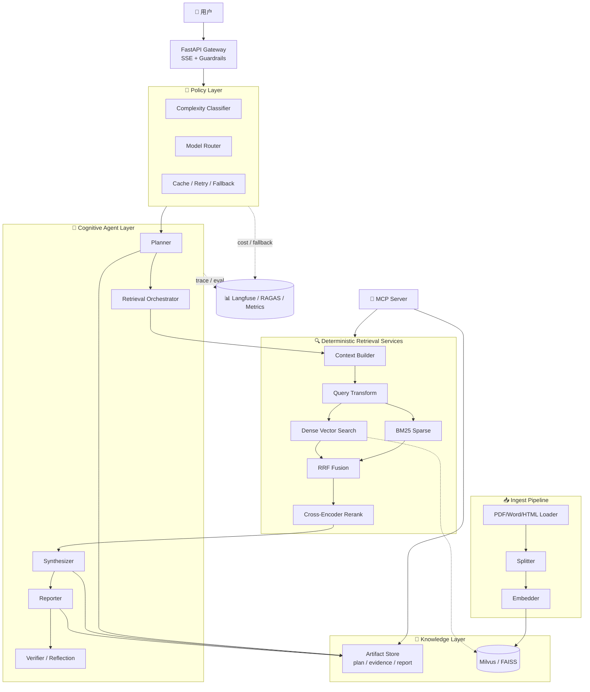

# KnowledgeOps · 生产导向研究型 Knowledge Agent 系统

> 面向企业知识场景，把复杂问题转成 `plan → retrieve → synthesize → report → verify` 的研究型 Agent 流程。
> 自研 MCP Server 暴露能力为标准协议，Claude Desktop / Cursor / Cline 可直接调用；通过模型路由与缓存做成本控制，而不是默认把所有请求打到最贵模型。

[](#-开发进度-sprint-看板)
[](https://www.python.org/)
[](https://langchain-ai.github.io/langgraph/)
[](LICENSE)

## 🗺 架构



详见 [docs/architecture.md](docs/architecture.md)。

## ✨ 核心特性

- 🔍 **研究型 Pipeline**：Planner → Retrieval Orchestrator → Synthesizer → Reporter → Verifier
- 🧱 **认知链路 Agent 化，执行链路服务化**：检索 / 重排 / 引用校验 / 评估保持 deterministic services
- 💸 **成本治理**：复杂度判定 + 模型路由 + 缓存 / fallback，不默认把所有请求打到最高价模型
- 🔌 **MCP Server**：自研协议接口，可被 Claude Desktop / Cursor / Cline 直接调用
- 📊 **LLMOps 本地安全边界**：Langfuse dry-run-safe 接入、本地 Docker Compose Langfuse trace/score smoke、RAGAS dry-run scaffold、业务指标和 Guardrails 防护（结构化输出 + 注入检测 + 引用强制）
- ⚡ **本地可演示交付**：FastAPI REST/SSE、Streamlit demo、反馈捕获、benchmark smoke、Docker Compose 本地全栈 smoke；云部署 / 100 QPS 压测保持手动或环境相关边界

## ✅ 实现状态边界

| 模块 / 能力 | 状态 | 说明 |
|---|---|---|
| FastAPI `/api/v1/query` | 已接入 | graph-backed 查询入口 |
| FastAPI `/api/v1/query/stream` | 已接入 | 有界 SSE wrapper，非 token-level LLM streaming |
| `/api/v1/feedback` | 已接入 | 本地内存捕获；Docker Compose 本地 Langfuse score 已验证 |
| PDF / Word / HTML ingest | 已接入 | 本地 loader + splitter，保留 source/page metadata |
| FAISS dense retrieval | 已接入 | 默认本地可跑；测试默认使用 hash embedding |
| BM25 sparse retrieval | 已接入 | `rank-bm25` 本地稀疏检索 |
| RRF hybrid retrieval | 已接入 | 当前主链路核心检索策略 |
| Context Builder | 已接入 | evidence 去重、排序、截断和上下文格式化 |
| Citation validation | 已接入 | verifier 节点用于校验引用和 human-review flag |
| MCP Server | 已实现并测试 | stdio server；外部 MCP client 接入属于手动验证 |
| Query Transform | 已实现，默认关闭 | `QUERY_TRANSFORM_ENABLED=false`；开启后扩展候选查询 |
| Cross-Encoder Rerank | 已实现，默认关闭 | `RERANK_ENABLED=false`；本地模型缺失时回退，不伪造 rerank 分数 |
| Langfuse | 已接入，本地 Compose 已验证 | 默认 `.env.example` disabled；Docker Compose 中本地 trace/score 已验证，见 `docs/docker-compose-smoke.md` |
| RAGAS | dry-run scaffold | 未运行真实 RAGAS 指标 |
| Docker Compose | 已完成本地全量联调 | `app + Milvus + Langfuse web/worker + ClickHouse + Postgres + Redis + MinIO` 已本机 smoke |
| Paid OpenAI-compatible API | 已验证可调用，不默认接入主链路 | 当前供应商可列 18 个模型；`deepseek-v4-pro` / `deepseek-v4-flash` 最小调用返回 `ok`；`deepseek-chat` / `deepseek-reasoner` 在当前供应商不可用 |
| Locust / 100 QPS | manual boundary | 脚本存在，未运行 100 QPS x 5min |
| Cloud deployment | manual boundary | 未声明公网部署完成 |

## 📈 性能指标状态

| 指标 | 目标 | Baseline (Sprint 2) | Final (Sprint 5) |
|---|---|---|---|
| 检索 Recall@5 | ≥ 85% | _待测_ | local 20-case source/page Hit@5：dense `0.75`，hybrid `1.0`；生产级 Recall@5 待测 |
| 端到端 P95 延迟 | < 3s | _待测_ | `pending_load_test` |
| 幻觉率（RAGAS Faithfulness） | ≤ 5% | _待测_ | `pending_real_run` |
| 单 query 成本 | < ¥0.05 | _待测_ | _待测，本地 smoke 无真实 LLM 计费_ |
| 最大并发 | ≥ 100 QPS | _待测_ | `pending_load_test` |

已执行的 Sprint 5 benchmark smoke：`uv run python scripts/benchmark.py --retrieval dense,hybrid --top-k 5`，返回 `status=ok`、`documents=93`，dense/hybrid 均返回 5 条候选。小规模 retrieval eval：`uv run python scripts/evaluate_retrieval.py --dataset eval/retrieval_qa.jsonl --docs-dir data --retrieval dense,hybrid --top-k 5 --embedding-backend hash`，20 条本地 source/page 标注集上 dense Hit@5 / Recall@5 为 `0.75`，hybrid 为 `1.0`。RAGAS、P95、成本、QPS 未在本地命令中测出，详见 [docs/benchmark.md](docs/benchmark.md)。

## 🚀 快速开始

### 本地开发 / 演示模式（无需 Docker）

```powershell
git clone https://github.com/Charol369/knowledge-ops
cd knowledge-ops
cp .env.example .env  # 可选：填 API / Langfuse 配置；默认本地 fallback 可跑 smoke
uv sync
uv run python scripts/ingest_pdfs.py data          # 使用现有本地样本批量入库
uv run uvicorn src.main:app --reload               # 启动 API
uv run streamlit run frontend/app.py               # 启动 Sprint 5 demo UI
```

### Docker Compose 本地全栈 Smoke

```powershell
docker compose up -d --build  # 启动 Milvus standalone + Langfuse + 应用
# 访问：
#   API           http://localhost:8000
#   Langfuse UI   http://localhost:3000
#   Milvus        http://localhost:19530
```

2026-06-22 已在本机完成 Docker Compose 全量 smoke：`app`、`milvus`、`langfuse-web`、`langfuse-worker`、`clickhouse`、`postgres`、`redis`、`minio` 均启动；API query、SSE、feedback、Langfuse trace/score 落库已验证。证据见 [docs/docker-compose-smoke.md](docs/docker-compose-smoke.md)。云部署、真实 `bge-m3` Docker 镜像、真实 RAGAS、Locust 100 QPS 仍未完成。

### API Smoke

```powershell
uv run pytest tests/integration/test_query_api.py
uv run pytest tests/integration/test_streaming.py
uv run pytest tests/integration/test_feedback.py
uv run python -c "from src.main import app; print(app.title)"
```

### External Interface Smoke（需要真实 `.env` + Docker 栈）

```powershell
uv run python scripts/smoke_external_interfaces.py --strict --include-container-provider --output eval/results/external_smoke_latest.json
```

### MCP 接入 Claude Desktop（**简历卖点**）

编辑 `%APPDATA%\Claude\claude_desktop_config.json`：

```json
{
  "mcpServers": {
    "knowledge-ops": {
      "command": "uv",
      "args": ["run", "python", "-m", "src.mcp.server"],
      "cwd": "C:/path/to/knowledge-ops"
    }
  }
}
```

重启 Claude Desktop → 直接 "搜索 knowledge-ops 里关于 XXX 的资料"。

## 📚 文档

- [架构设计](docs/architecture.md) - 模块说明 + 技术选型理由
- [开发执行文档](docs/development.md) - 项目 1 完整实现的 `/goal` prompt + 拆分建议
- [API 文档](docs/api.md) - REST + SSE + Pydantic schema
- [评测报告](docs/benchmark.md) - 本地 benchmark smoke + 未测指标边界
- [交付边界](docs/delivery.md) - Docker / 云部署 / demo video / resume 的手动边界
- [Docker Compose smoke](docs/docker-compose-smoke.md) - 本地全栈与 Langfuse trace/score 验证记录
- [外部接口 smoke artifact](eval/results/external_smoke_latest.json) - 当前 provider / 本地服务 / Docker 依赖检查输出
- [架构决策记录 (ADR)](docs/decisions/)
  - [001: 为什么选 LangGraph](docs/decisions/001-why-langgraph.md)

## 🛠️ 技术栈

`Python 3.11` · `uv` · `FastAPI` · `Streamlit` · `LangChain 1.x` · `LangGraph 1.x` · `Milvus / FAISS` · `bge-m3` · `bge-reranker-v2-m3` · `rank-bm25` · `RAGAS` · `Langfuse v4 (OpenTelemetry)` · `Pydantic v2` · `MCP` · `OpenAI-compatible API` · `Docker Compose` · `pytest` · `Locust` · `Model Router` · `Artifact Store` · `Context Builder`

## 📅 开发进度（Sprint 看板）

| Sprint | 周次 | 目标 | 状态 |
|---|---|---|---|
| **W1** | 5/18-5/24 | 知识速成 + 项目骨架 | Done |
| **Sprint 1** | W2 (5/25-5/31) | 最小研究闭环 + 证据管线 | Done，本地 smoke |
| **Sprint 2** | W3 (6/1-6/7) | 混合检索 + 上下文工程 | Done，本地 smoke |
| **Sprint 3** | W4 (6/8-6/14) | 混合范式 Agent 图 + MCP 工具层 | Done，本地 smoke |
| **Sprint 4** | W5 (6/15-6/21) | Policy Layer + LLMOps | Done，本地 dry-run / smoke |
| **Sprint 5** | W6 (6/22-6/30) | Streaming、feedback、demo、benchmark、docs、Docker Compose local smoke | 本地完成；Docker Compose + 本地 Langfuse trace/score 已验证；云部署、视频、申请为手动边界 |

## 📂 目录结构

```
knowledge-ops/
├── docs/                  # 架构 / ADR / API / benchmark
├── src/
│   ├── policy.py         # 复杂度判定 / 模型路由 / fallback
│   ├── ingest/           # 数据接入（loaders / splitters / embedder）
│   ├── retrieval/        # 检索服务（context_builder / artifact_store / dense / sparse / hybrid / rerank / query_transform）
│   ├── agents/           # 认知层（planner / orchestrator / synthesizer / reporter / verifier / graph / tools / memory）
│   ├── guardrails/       # 防护层（injection / output_schema / citation）
│   ├── api/              # FastAPI 路由 + Pydantic schemas
│   ├── mcp/              # MCP Server
│   └── observability/    # Langfuse + 业务指标
├── eval/                 # RAGAS 测试集 + 评估脚本
├── tests/                # 单测 + 集成测试
├── scripts/              # 批量入库 / 压测 / benchmark
├── frontend/             # Research UI（W6）
├── notes/                # W1 速成笔记（Day1-Day7）
├── docker-compose.yml
├── Dockerfile
└── pyproject.toml
```

## 📜 License

MIT
