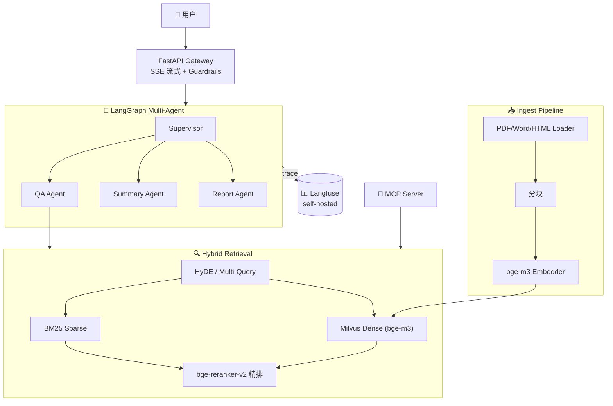

# KnowledgeOps · 企业级 RAG + Multi-Agent 知识库平台

> 基于 LangGraph 的 Multi-Agent 架构，支持企业文档的智能问答、总结与报告生成。
> 自研 MCP Server 暴露知识库为标准协议，Claude Desktop / Cursor / Cline 可直接调用。

[](#-开发进度-sprint-看板)
[](https://www.python.org/)
[](https://langchain-ai.github.io/langgraph/)
[](LICENSE)

## 🗺 架构



详见 [docs/architecture.md](docs/architecture.md)。

## ✨ 核心特性

- 🔍 **混合检索**：BM25 稀疏 + Milvus 稠密 + bge-reranker-v2 精排 + HyDE 查询重写
- 🤖 **Multi-Agent（Supervisor 模式）**：QA / Summary / Report 三 Agent，LangGraph 编排状态机
- 🔌 **MCP Server**：自研协议接口，可被 Claude Desktop / Cursor / Cline 直接调用
- 📊 **LLMOps 完整链路**：Langfuse 全链路追踪 + RAGAS 自动评估 + Guardrails 防护（结构化输出 + 注入检测 + 引用强制）
- ⚡ **生产就绪**：FastAPI SSE 流式 + Docker Compose 一键起 + 100 QPS 压测验证

## 📈 性能指标（W6 末测出）

| 指标 | 目标 | Baseline (Sprint 2) | Final (Sprint 5) |
|---|---|---|---|
| 检索 Recall@5 | ≥ 85% | _待测_ | _待测_ |
| 端到端 P95 延迟 | < 3s | _待测_ | _待测_ |
| 幻觉率（RAGAS Faithfulness） | ≤ 5% | _待测_ | _待测_ |
| 单 query 成本 | < ¥0.05 | _待测_ | _待测_ |
| 最大并发 | ≥ 100 QPS | _待测_ | _待测_ |

测试方法：100 条 QA pair（FAQ + 知识库 + 闲聊 + 注入攻击）→ RAGAS + Locust，详见 [docs/benchmark.md](docs/benchmark.md)。

## 🚀 快速开始

### 开发模式（W1-Sprint 3，无需 Docker）

```powershell
git clone https://github.com/Charol369/knowledge-ops
cd knowledge-ops
cp .env.example .env  # 填 DEEPSEEK_API_KEY
uv sync               # 装依赖
uv run python scripts/ingest_pdfs.py data/pdfs/    # 批量入库
uv run uvicorn src.main:app --reload               # 启动 API
```

### 生产模式（Sprint 4+，Docker Compose 一键起）

```powershell
docker compose up -d  # 起 Milvus standalone + Langfuse + 应用
# 访问：
#   API           http://localhost:8000
#   Langfuse UI   http://localhost:3000
#   Milvus        http://localhost:19530
```

### MCP 接入 Claude Desktop（**简历卖点**）

编辑 `%APPDATA%\Claude\claude_desktop_config.json`：

```json
{
  "mcpServers": {
    "knowledge-ops": {
      "command": "uv",
      "args": ["run", "python", "-m", "src.mcp.server"],
      "cwd": "C:/path/to/knowledge-ops"
    }
  }
}
```

重启 Claude Desktop → 直接 "搜索 knowledge-ops 里关于 XXX 的资料"。

## 📚 文档

- [架构设计](docs/architecture.md) - 模块说明 + 技术选型理由
- [API 文档](docs/api.md) - REST + SSE + Pydantic schema
- [评测报告](docs/benchmark.md) - RAGAS + Locust 压测结果
- [架构决策记录 (ADR)](docs/decisions/)
  - [001: 为什么选 LangGraph](docs/decisions/001-why-langgraph.md)

## 🛠️ 技术栈

`Python 3.11` · `uv` · `FastAPI` · `LangChain 1.x` · `LangGraph 1.x` · `Milvus / FAISS` · `bge-m3` · `bge-reranker-v2-m3` · `rank-bm25` · `RAGAS` · `Langfuse v4 (OpenTelemetry)` · `Pydantic v2` · `MCP` · `DeepSeek API` · `Docker Compose` · `pytest` · `Locust`

## 📅 开发进度（Sprint 看板）

| Sprint | 周次 | 目标 | 状态 |
|---|---|---|---|
| **W1** | 5/18-5/24 | 知识速成 + 项目骨架 | ✅ **Done**（你正在看的版本） |
| **Sprint 1** | W2 (5/25-5/31) | 数据 + 索引 + 基础 RAG（CLI 跑通 PDF 问答） | 🔜 |
| **Sprint 2** | W3 (6/1-6/7) | 混合检索 + Rerank + RAGAS 基线 | 🔜 |
| **Sprint 3** | W4 (6/8-6/14) | LangGraph Multi-Agent + MCP Server | 🔜 |
| **Sprint 4** | W5 (6/15-6/21) | LLMOps 工程化（Langfuse 自托管 + Guardrails） | 🔜 |
| **Sprint 5** | W6 (6/22-6/30) | 上线 + Demo + 简历视频 | 🔜 |

## 📂 目录结构

```
knowledge-ops/
├── docs/                  # 文档（架构图 / ADR / API / benchmark）
├── src/
│   ├── ingest/            # 数据接入（loaders / splitters / embedder）
│   ├── retrieval/         # 检索层（dense / sparse / hybrid / rerank / query_transform）
│   ├── agents/            # Multi-Agent 编排（graph / qa / summary / report / tools / memory）
│   ├── guardrails/        # 防护层（injection / output_schema / citation）
│   ├── api/               # FastAPI 路由 + Pydantic schemas
│   ├── mcp/               # MCP Server
│   └── observability/     # Langfuse + 业务指标
├── eval/                  # RAGAS 测试集 + 评估脚本
├── tests/                 # 单测 + 集成测试
├── scripts/               # 批量入库 / 压测 / benchmark
├── frontend/              # Streamlit（W6）
├── notes/                 # W1 速成笔记（Day1-Day7）
├── docker-compose.yml
├── Dockerfile
└── pyproject.toml
```

## 📜 License

MIT
