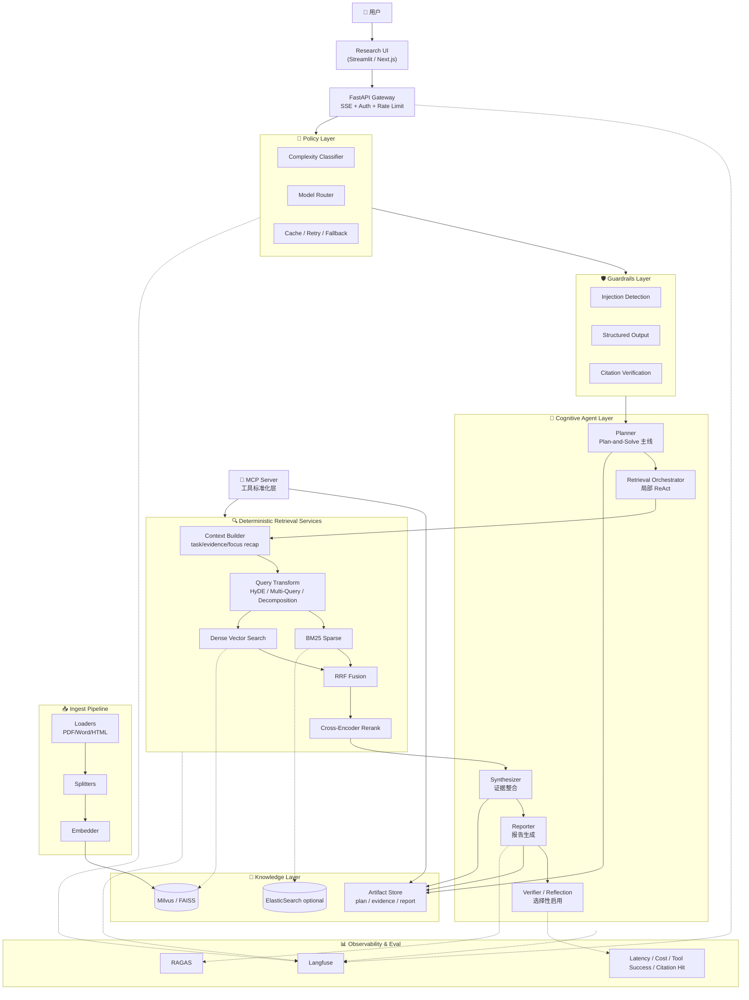

# KnowledgeOps · 系统架构

> 项目 1 的正式定义不是“技术栈拼装的 RAG 平台”，而是**生产导向的研究型 Knowledge Agent 系统**。
> 这份文档从第一天起就把产品定位、成本策略、上下文工程、Agent 边界、评估与部署一起设计进去，而不是后补升级。

## 🎯 核心定位

**一句话**：面向企业知识场景，构建一个可部署、可评估、可控成本的研究型 Agent 系统。  
它的目标不是“回答一个问题”而已，而是把复杂问题转化为：

> `plan → retrieve → synthesize → report → verify`

并且全程保留证据、控制 token 成本、支持失败回退与链路观测。

## 🧭 四条顶层原则

1. **认知链路 Agent 化，执行链路服务化**  
   Planner / Synthesizer / Reporter / Verifier 走 Agent；Ingest / Retrieval / Rerank / Citation / Eval / Cache / Rate Limit 保持普通服务。
2. **模型路由与成本套利是一等公民**  
   简单任务默认走便宜模型，复杂任务才升级到高阶模型；不允许默认把所有请求打到最贵模型。
3. **上下文工程与检索同级重要**  
   不是把所有历史原样塞进 prompt，而是做 system/project/task/evidence/focus recap 分层治理。
4. **从 W2 开始就按生产者视角写项目**  
   所有模块都要回答：是否可部署？是否可观测？是否可控成本？是否可 debug？

---

## 🗺 总体架构图（mermaid）



> **这张图最重要的思想不是多了多少模块，而是明确区分：Agent 做认知决策，Services 做确定性执行，Policy 控制成本与质量。**

---

## ✅ 当前实现状态边界

| 模块 / 能力 | 状态 | 架构边界 |
|---|---|---|
| `planner -> retrieval_orchestrator -> synthesizer -> reporter -> verifier` | 已接入主链路 | 固定 LangGraph 流程，不是自由游走的多 Agent |
| `/api/v1/query` | 已接入主链路 | 调用 graph-backed 查询 |
| `/api/v1/query/stream` | 已接入主链路 | 有界 SSE wrapper，复用 query 合约 |
| `/api/v1/feedback` | 已接入主链路 | 本地指标记录；Docker Compose 本地 Langfuse score 已验证 |
| FAISS dense retrieval | 已接入主链路 | 默认本地 smoke 使用 hash embedding |
| BM25 sparse retrieval | 已接入主链路 | 关键词/术语召回补充 |
| RRF hybrid retrieval | 已接入主链路 | 当前默认融合策略 |
| Context Builder | 已接入主链路 | evidence 去重、排序、截断、格式化 |
| Citation validation | 已接入主链路 | verifier 校验 answer citations |
| Query Transform | 已实现，默认关闭 | `QUERY_TRANSFORM_ENABLED=false`；开启后扩展候选查询 |
| Cross-Encoder Rerank | 已实现，默认关闭 | `RERANK_ENABLED=false`；本地模型缺失时回退原候选，不伪造分数 |
| Langfuse | 已接入，本地 Compose 已验证 | 默认 disabled；Docker Compose 下本地 trace/score 已落库，见 `docs/docker-compose-smoke.md` |
| RAGAS | dry-run scaffold | 未运行真实 RAGAS 指标 |
| Docker Compose / Milvus / Langfuse stack | 已完成本地全量联调 | `app + Milvus + Langfuse web/worker + ClickHouse + Postgres + Redis + MinIO` 已本机 smoke |
| LLM synthesis | 已接入主链路 | `LLM_SYNTHESIS_ENABLED=true` 时用 OpenAI-compatible Chat Completions 生成自然语言答案，并由 verifier 校验 citation；失败时 deterministic fallback |
| Paid OpenAI-compatible API | 已接入主链路并验证 | 当前供应商可列 18 个模型；`deepseek-v4-pro` 已在 `/api/v1/query` synthesis 主链路返回 `synthesis_mode=llm` / `synthesis_status=ok`；`deepseek-v4-flash` 最小调用通过；`deepseek-chat` / `deepseek-reasoner` 在当前供应商不可用 |
| Locust / 100 QPS | manual boundary | 脚本存在，未声明已压测达标 |
| Cloud deployment | manual boundary | 未声明已公网部署 |

当前默认查询链路是：`question -> planner -> dense + BM25 -> RRF -> Context Builder -> synthesize/report -> citation verification`。Query Transform 和 Cross-Encoder Rerank 是可选增强层，不是默认 smoke 的必要条件。

---

## 📦 分层解释

## 1. Deterministic Service Layer：不该 Agent 化的部分

这些部分都应保持普通服务实现，而不是让 Agent 自由决定：

| 模块 | 职责 | 为什么不 Agent 化 |
|---|---|---|
| `src/ingest/*` | 文档加载、分块、嵌入 | 可确定、可测试、可缓存 |
| `src/retrieval/dense.py` | 稠密向量检索 | 纯检索逻辑，不需主观推理 |
| `src/retrieval/sparse.py` | BM25 稀疏检索 | 同上 |
| `src/retrieval/hybrid.py` | RRF 融合 | 数学规则，非认知决策 |
| `src/retrieval/rerank.py` | 精排 | 独立服务链路更稳 |
| `src/guardrails/citation.py` | 引用校验 | 规则型逻辑，必须可审计 |
| `eval/*` | 评估与 benchmark | 离线脚本，非实时推理 |
| `src/api/*` | 鉴权、限流、SSE、缓存接口 | 标准后端工程职责 |

**项目亮点提法**：很多初学者项目会把几乎所有东西都做成 Agent，最后系统成本高、难控、难 debug；KnowledgeOps 刻意避免这一点。

---

## 2. Cognitive Agent Layer：真正需要 Agent 的部分

这一层只保留高不确定性、高价值的认知工作。

### 2.1 Planner
- 判断用户问题是否需要 research plan
- 拆出 2-5 个子任务
- 决定是否需要多轮检索 / 是否需要高级模型

### 2.2 Retrieval Orchestrator
- 不直接做检索，而是**编排检索服务**
- 必要时局部采用 ReAct 方式：
  - 先检索
  - 看结果够不够
  - 不够则重写 query 或分解子问题再检索

### 2.3 Synthesizer
- 对每个子任务的 evidence 做归纳
- 形成中间结论，不急着生成漂亮答案

### 2.4 Reporter
- 把中间结论组织成最终输出
- 负责 Markdown / 结构化报告 / citation 编号

### 2.5 Verifier / Reflection
- 默认不对所有请求启用
- 仅在复杂研究、最终报告、冲突证据场景启用
- 作用是“有选择地用额外 token 换质量”

---

## 3. Policy Layer：生产者视角的核心

这是旧版架构里隐含但未显式表达的层，现在要提升为一等公民。

### 3.1 Complexity Classifier
判定请求属于：
- FAQ / 单跳查询
- 普通知识问答
- 多文档整合
- 复杂研究型问题

### 3.2 Model Router
按照复杂度路由模型，而不是一刀切。

| Tier | 模型级别 | 适用任务 |
|---|---|---|
| Tier 0 | 非模型路径 | 缓存命中、元信息读取、健康检查 |
| Tier 1 | 廉价快速模型 | intent classify、query rewrite、轻量摘要、注入二判 |
| Tier 2 | 中档主力模型 | 常规 RAG synthesis、子任务摘要、结构化回答 |
| Tier 3 | 高阶模型 | 长上下文复杂研究、最终报告、Reflection、冲突证据仲裁 |

### 3.3 Cache / Retry / Fallback
- 可缓存的 query 直接命中缓存
- 工具失败时走 fallback，不让主图崩掉
- 高阶模型不可用时可降级到中档模型 + 缩小任务范围

> **这一层正是“生产环境里的 token 套利”与“成本治理”的落地点。**

---

## 4. Context Engineering：与 Retrieval 同级的重要基础设施

Hello-Agents Chapter 9 对本项目最有价值的启发，就是上下文工程不能后置。

### 4.1 Context 分层
| 层 | 内容 |
|---|---|
| System Context | 角色、边界、安全规则、输出协议 |
| Project Context | 项目设定、当前 KB 范围、配置策略 |
| Task Context | 当前问题、当前 plan、当前子任务状态 |
| Evidence Context | 检索回来的 chunk + source/page metadata |
| Focus Recap | 历史执行结果压缩摘要 |

### 4.2 Artifact Store
中间产物不直接塞进 prompt，而是持久化：
- `plan.json`
- `subtask_evidence.json`
- `synthesis.json`
- `final_report.md`

这样带来三个好处：
1. 可复盘
2. 可调试
3. 可恢复长任务

---

## 5. Retrieval Layer（`src/retrieval/`）

| 子模块 | 职责 | 何时上 |
|---|---|---|
| `dense.py` | 稠密检索基线 | Sprint 1 |
| `sparse.py` | BM25 稀疏检索 | Sprint 2 |
| `hybrid.py` | RRF 融合 | Sprint 2 |
| `rerank.py` | Cross-Encoder 精排 | Sprint 2 |
| `query_transform.py` | HyDE / Multi-Query / Decomposition | Sprint 2 |

**核心 pipeline**：
```text
question
  → planner / decomposition
  → query_transform
  → BM25 + Dense
  → RRF
  → Rerank
  → context_builder
  → synthesizer
```

---

## 6. MCP Server：工具标准化层，而不是炫技层

`src/mcp/server.py` 的角色应明确为：
- 向外暴露 retrieval / summarize / artifact metadata 能力
- 让 Claude Desktop / Cursor / Cline 复用你的系统能力
- 不承担 A2A / ANP 级别的复杂网络职责

| 暴露内容 | 实现意图 |
|---|---|
| `search_knowledge` | 调 retrieval services，返回带 metadata 的 evidence |
| `summarize_documents` | 调 synthesizer / reporter 的轻量能力 |
| `knowledge://collections/{name}` | 暴露 collection 元信息与状态 |

---

## 7. Guardrails Layer

| 子模块 | 职责 | Sprint |
|---|---|---|
| `injection.py` | Prompt Injection 检测 + LLM-as-judge 二级判断 | 4 |
| `output_schema.py` | 结构化输出，约束 Agent 自由发挥 | 3 |
| `citation.py` | 引用提取 + 真实指向校验 | 3 |

核心思想：
- “引用存在”不等于“引用真实”
- Guardrails 不只是挡攻击，也是在保障**可解释性与可审计性**

---

## 8. Observability & Eval

| 组件 | 解决什么 | 部署 |
|---|---|---|
| **Langfuse** | LLM 全链路追踪，含 policy / graph / retrieval / final generation | Docker compose |
| **RAGAS** | answer faithfulness / relevancy / context precision/recall | 离线脚本 |
| **业务指标** | latency / token cost / tool success / citation hit / fallback rate | Metrics |

### 评估分三层
1. **Retrieval / Tool correctness**
2. **End-to-end answer quality**
3. **Workflow efficiency / cost**

这比“只有 RAGAS”更符合生产项目要求。

---

## 🎯 关键技术选型理由（详见 `docs/decisions/`）

| 选择 | 原因 | ADR |
|---|---|---|
| LangGraph > AutoGen / CrewAI | 显式状态、循环、HITL、可控性更强，适合生产型研究管线 | [001](decisions/001-why-langgraph.md) |
| 混合范式 > 纯 ReAct | 研究型任务更适合 Plan-and-Solve 主线 + 局部 ReAct + 选择性 Reflection | TODO |
| bge-m3 > OpenAI embedding | 多语言、可自托管、与成本策略一致 | TODO 002 |
| Hybrid > Dense-only | 关键词类查询稀疏 BM25 常常更稳 | TODO 003 |
| Milvus / FAISS 双路径 | 开发先 FAISS，生产再切 Milvus，兼顾推进速度与招聘关键词 | TODO 004 |
| Langfuse > LangSmith | 自托管、可控、OTel 原生 | TODO 005 |
| 模型路由 > 单模型硬打 | 真正体现生产者视角与 token 成本治理 | TODO |
| MCP > 单纯 Function Calling | 工具层标准化、跨 Client 复用 | TODO 007 |

---

## 📈 性能指标目标与当前状态

| 指标 | 目标 | 当前状态 |
|---|---|---|
| 检索 Recall@5 | ≥ 85% | 20 条本地 source/page 标注集：dense Hit@5 / Recall@5 `0.75`，hybrid `1.0`；生产级 Recall@5 待更大标注集 |
| 端到端 P95 延迟 | < 3s | `pending_load_test`，未运行 Locust 100 QPS x 5min |
| 幻觉率 | ≤ 5% | `pending_real_run`，未运行真实 RAGAS |
| 单 query 成本 | < ¥0.05 | 待测，主链路已接真实 LLM 但未完成成本统计 |
| 最大并发 | ≥ 100 QPS | `pending_load_test` |

### 额外建议跟踪指标
- tool call success rate
- reflection trigger rate
- fallback rate
- citation verification hit rate
- average model tier used

---

## 🔜 实施 Roadmap（5 周）

| Sprint | 周次 | 目标 | 验收 |
|---|---|---|---|
| **Sprint 1** | W2 | 最小研究闭环 + 证据管线 | CLI research pipeline 跑通 |
| **Sprint 2** | W3 | 检索增强 + 上下文工程 | Context Builder 可用；Recall@5 待真实标注集 |
| **Sprint 3** | W4 | 混合范式 Agent 图 + MCP | graph + MCP 接入验证 |
| **Sprint 4** | W5 | Policy Layer + LLMOps | 模型路由 + Langfuse dry-run + Guardrails |
| **Sprint 5** | W6 | Streaming + Demo + benchmark + docs + Docker local smoke | 本地 demo/API/benchmark/Docker Compose/Langfuse trace smoke；云部署、视频、申请为手动边界 |

---

## ✅ 面试表达模板（项目灵魂）

> KnowledgeOps 的核心不是“用了很多 Agent 技术”，而是做了一个生产导向的研究型 Knowledge Agent：
> - 只把高不确定性部分 Agent 化
> - 让检索、重排、引用校验等链路保持服务化
> - 用模型路由和缓存做 token 套利
> - 用 Langfuse / RAGAS / 业务指标保证可观测与可评估
> - 用 MCP 把能力标准化暴露给外部 Client

这就是它区别于普通教学型 RAG 项目的地方。
