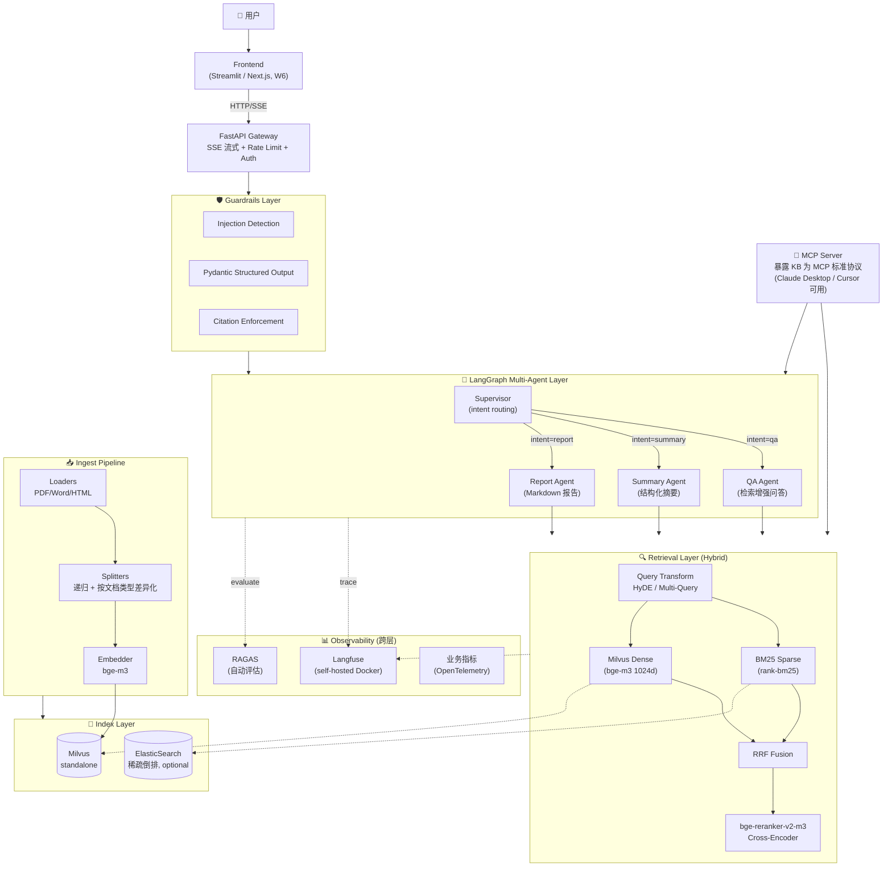

# KnowledgeOps · 系统架构

> 项目 1 完整架构 + 模块说明 + 关键选型理由。
> Day7（W1 末）顶层设计版本，后续 Sprint 1-5 逐步落实。

## 🗺 总体架构图（mermaid）



> 注：Day7 之后用 Excalidraw 把此图画成 PNG 放 `docs/architecture.png`，让 GitHub README 上有图。当前 mermaid 版本已经能在 GitHub 上原生渲染。

---

## 📦 模块说明（按数据流顺序）

### 1. Ingest Pipeline（`src/ingest/`）

| 子模块 | 职责 | 关键技术 | Sprint |
|---|---|---|---|
| `loaders.py` | PDF / Word / HTML → `List[Document]` | PyPDFLoader / python-docx / bs4 | 1 |
| `splitters.py` | 文档分块 | RecursiveCharacterTextSplitter（baseline）+ 按文档类型差异化（进阶） | 1 / 2 |
| `embedder.py` | 文本 → 1024 维向量 | bge-m3（多语言，2.3GB） | 1 |

**关键设计**：metadata 必须含 `source` + `page` —— **citation 全靠这两个字段回溯**。

### 2. Index Layer

| 组件 | 职责 | 部署 |
|---|---|---|
| **Milvus standalone** | 稠密向量库（HNSW 索引） | Docker compose, port 19530 |
| **ElasticSearch**（可选） | 稀疏倒排（生产规模才用，原型用 rank-bm25 即可） | Docker compose, port 9200 |

**W1 → Sprint 1 临时方案**：用 FAISS 替代 Milvus standalone（Day4 笔记记录的 langchain-milvus 0.3.3 + pymilvus 2.6 兼容 bug）。Sprint 3 LLMOps 上 Docker 时切回真正 Milvus。

### 3. Retrieval Layer（`src/retrieval/`）

| 子模块 | 职责 | 何时上 |
|---|---|---|
| `dense.py` | 稠密向量检索（基线） | Sprint 1 |
| `sparse.py` | BM25 稀疏检索 | Sprint 2 |
| `hybrid.py` | RRF 融合 dense + sparse | Sprint 2 |
| `rerank.py` | Cross-Encoder 精排 | Sprint 2 |
| `query_transform.py` | HyDE / Multi-Query | Sprint 2 |

**核心 pipeline**：
```
query → query_transform（HyDE 扩展 → N 个 query）
       ↓
       ├── BM25 Top-20 ──┐
       └── Dense Top-20 ─┴→ RRF 融合 → Top-20 → Rerank → Top-5 → LLM
```

### 4. Multi-Agent Layer（`src/agents/`）

Supervisor 模式（Day5 03_supervisor.py 验证过简化版）：

```
START → supervisor → (intent=qa)      → qa_agent      → END
                  → (intent=summary)  → summary_agent → END
                  → (intent=report)   → report_agent  → END
```

| 子模块 | 职责 | Sprint |
|---|---|---|
| `graph.py` | LangGraph 主图 + State Schema + 路由函数 | 3 |
| `qa_agent.py` | QA Agent（7 层 prompt，防幻觉 4 把刀） | 3 |
| `summary_agent.py` | 结构化摘要 | 3 |
| `report_agent.py` | Markdown 报告 + citation 编号 | 3 |
| `tools.py` | Function Calling 工具集（search_kb / calculator / get_date） | 3 |
| `memory.py` | LangGraph Checkpointer（W1 内存版 → Sprint 4 Postgres 持久化） | 3 / 4 |

### 5. Guardrails Layer（`src/guardrails/`）

防御纵深 6 层中的 3 个核心（详见 `notes/day6/NOTES.md`）：

| 子模块 | 职责 | Sprint |
|---|---|---|
| `injection.py` | Prompt Injection 关键词检测 + LLM-as-judge | 4 |
| `output_schema.py` | Pydantic structured output（防自由发挥） | 3 |
| `citation.py` | 强制引用提取 + 校验（防编造来源） | 3 |

### 6. API Layer（`src/api/`）

| 子模块 | 职责 | Sprint |
|---|---|---|
| `routes.py` | `/api/v1/query` + `/api/v1/ingest` | 3 / 4 |
| `schemas.py` | Pydantic 请求/响应模型 | 3 |

**Sprint 5 升级**：`/query` 切 SSE 流式响应（用户感知延迟降低）。

### 7. MCP Server（`src/mcp/`）

**项目 1 的简历核心卖点**：把 KnowledgeOps 暴露为 MCP 标准协议，让 Claude Desktop / Cursor / Cline 等 MCP Client 直接调用。

| 暴露内容 | 实现 |
|---|---|
| **Tool**：`search_knowledge` / `summarize_documents` | 接到 Retrieval + QA Agent |
| **Resource**：`knowledge://collections/{name}` | 暴露 collection 元信息 |

### 8. Observability（`src/observability/`）

| 组件 | 解决什么 | 部署 |
|---|---|---|
| **Langfuse** | LLM 全链路追踪（每个 chain step 一个 OTel span） | Docker compose, port 3000 |
| **RAGAS** | 自动评估（faithfulness / answer_relevancy / context_precision/recall） | 离线脚本 `eval/run_ragas.py` |
| **业务指标** | 意图分布 / 引用准确率 / 用户反馈率 | OpenTelemetry metrics（Prometheus 拉） |

---

## 🎯 关键技术选型理由（详见 `docs/decisions/`）

| 选择 | 原因 | ADR |
|---|---|---|
| LangGraph > AutoGen / CrewAI | 状态机暴露给开发者 + Graph 可视化 + HITL 一等公民 | [001](decisions/001-why-langgraph.md) |
| bge-m3 > OpenAI text-embedding-3 | 多语言 + 1024 维 + 自托管不依赖 OpenAI key | TODO 002 |
| Hybrid > Dense-only | 关键词类查询稀疏 BM25 反而更准 | TODO 003 |
| Milvus > FAISS / Qdrant / Pinecone | 国内生态成熟 + 招聘市场最主流 + HNSW/IVF 双索引覆盖大小数据 | TODO 004 |
| Langfuse > LangSmith | 开源 + 自托管（数据不出网，合规友好）+ OpenTelemetry 原生 | TODO 005 |
| DeepSeek > GPT-4 / Claude | 成本（W1 实测 ¥10 跑完一周）+ 兼容 OpenAI 协议 + 国内访问稳定 | TODO 006 |
| MCP > 单纯 Function Calling | 跨厂商复用（一个 server 给所有 Client 用） + 暴露 Tool/Resource/Prompt 三类 | TODO 007 |

---

## 📈 性能指标目标（W6 末测出来）

| 指标 | 目标 | 测试方法 |
|---|---|---|
| 检索 Recall@5 | ≥ 85% | RAGAS context_recall + 100 条测试集 |
| 端到端 P95 延迟 | < 3s（rerank+LLM） | Locust 100 QPS × 5min |
| 幻觉率 | ≤ 5% | RAGAS faithfulness |
| 单 query 成本 | < ¥0.05 | Langfuse cost tracking |
| 最大并发 | ≥ 100 QPS | Locust 压测 |

**简历金句素材**：*"项目 1 在 100 QPS 压测下 P95 延迟 < 3s，幻觉率 4%（vs baseline 18%），单 query 成本 ¥0.03，已用 RAGAS 100 条测试集回归。"*

---

## 🔜 实施 Roadmap（5 周）

| Sprint | 周次 | 目标 | 验收 |
|---|---|---|---|
| **Sprint 1** | W2（5/25-5/31） | 数据 + 索引 + 基础 RAG | CLI 跑通 PDF 问答 |
| **Sprint 2** | W3（6/1-6/7） | 混合检索 + Rerank + RAGAS | 基线指标出炉 |
| **Sprint 3** | W4（6/8-6/14） | Multi-Agent + MCP | 3 Agent 协作 + MCP Inspector 验证 |
| **Sprint 4** | W5（6/15-6/21） | LLMOps 工程化 | Langfuse 自托管 + Guardrails 上线 |
| **Sprint 5** | W6（6/22-6/30） | 上线 + Demo | Docker 一键起 + 简历视频 |
